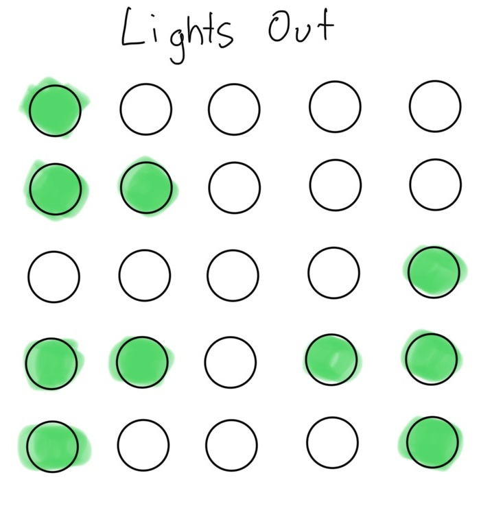

# Project: Build a Lights Out game with React

In this project, you'll create the "Lights Out" game using React.

For every step:
- Read the brief and acceptance criteria. If unsure, seek help immediately.
- When you’ve fulfilled the acceptance criteria, make a commit and push it to GitHub.

Here's a sketch of what you'll build:



---

## Step 1: Fork the starter repository

**Brief:**  
Fork this repository to your account to begin the project. Check that the project can run (`npm install`, `npm run start`).

**Acceptance Criteria:**
- ✅ The repository is forked to your GitHub account.
- ✅ You have cloned the forked repository to your local machine.
- ✅ You have ran the project and it displays an empty page.

---

## Step 2: Create the Header component

**Brief:**  
Build a `Header` component that displays the app's title.

**Acceptance Criteria:**
- ✅ Your repository contains `Header.js` file in the appropriate folder.
- ✅ `Header.js` contains a functional component that renders an `<h1>` with the title "Lights Out".
- ✅ The header component is at the top of the page.

---

## Step 3: Create the Cell component

**Brief:**  
Build a `Cell` component representing a single light. The component should be a clickable button. Add css to make the button look like a light. Display two `Cell` components in your app; one of each type.

Below is a sample style to get you started:
```
width: 25px;
height: 25px;
border-radius: 50%;
border: none;
margin: 20px;
background-color: rgb(28, 195, 72);
```

**Acceptance Criteria:**
- ✅ Your repository contains `Cell.js` and `Cell.css` files in the appropriate folder.
- ✅ `Cell` accepts `cellIndex`, `isOn`, and `toggleLight` as props.
- ✅ `Cell.css` contains a style representing an "on" light and an "off" light.
- ✅ `Cell` renders a button with the appropriate style depending on the prop `isOn`.
- ✅ The app renders an "on" `Cell` and an "off" `Cell`.

---

## Step 4: Create the Board component

**Brief:**  
Build a `Board` component which represents the 5x5 grid where the `Cell`s will be placed. The grid should be a 2d 5x5 array of bools which is stored in the component's state. 

**Acceptance Criteria:**
- ✅ `Board` contains a functional component that imports `Cell`.
- ✅ `Board` contains a 5x5 2d array of `bool` which represents the state of each light.
- ✅ `Board` should pass the index of the array and the light state into `Cell`s props.
- ✅ The app renders the `Board`.
- ✅ `Board` renders a 5x5 grid of cells based on the 2d array.

---

## Step 5: Create a static board of lights for testing the game

**Brief:**  
Instead of an empty 2d array, programatically set some of the values in the array to `true` so that the `Cell`s light up. The `Cell`s should light up depending on which values in the array are `true`.

**Acceptance Criteria:**
- ✅ The board state is not empty (i.e. not all `false`)
- ✅ The correct `Cell`s are lit up.

---

## Step 6: Make the lights toggle when clicked

**Brief:**  
When a light is clicked, the clicked light should toggle between on and off, and the board state should update accordingly. 

**Acceptance Criteria:**
- ✅ `Cell` contains an `onclick` handler which executes the `toggleLight` function from the props. `toggleLight` should pass its own index (`cellIndex`) as a parameter.
- ✅ `Board` contains a function which updates the board state based on the selected light. This function should be passed into `Cell`s props.
- ✅ When a light is clicked, it should toggle to the opposite state.

---

## Step 7: Make the adjacent lights toggle

**Brief:**  
When a light is clicked, the clicked light and its neighbours (not counting diagonal ones) should toggle.

**Acceptance Criteria:**
- ✅ When a light is clicked, it's neightbours (up, down, left, right) and itself should toggle to the opposite state.

---

## Step 8: Check if the player has won

**Brief:**  
When all the lights are off, the app should show that the player has won.

**Acceptance Criteria:**
- ✅ When all the lights are off, the app should show that the player has won.

---

## Step 9: Generate a random board of lights

**Brief:**  
Instead of a hardcoded board state, randomise the board state when starting the app. You can import `BoardGenerator.js` and use `newBoard()` to get a random 5x5 2d array of bools.

**Acceptance Criteria:**
- ✅ The lights are randomly lit on each new game.

---

## Step 10: Basic Styling

**Brief:**  
Add styles to enhance the layout and make the app visually appealing.

---

## Step 11: Final Review and Refactor

**Brief:**  
Review the app to ensure it meets all acceptance criteria, refactor code for readability, and add comments where needed.

**Acceptance Criteria:**
- ✅ The code is clean, with properly named variables and functions.
- ✅ Unnecessary console logs are removed.
- ✅ All components function as expected without errors.

--- 

### Resources

Working demo:

https://limeyuzu.github.io/lightsout/


A solver for Lights Out:

https://www.jaapsch.net/puzzles/javascript/lightjcl.htm