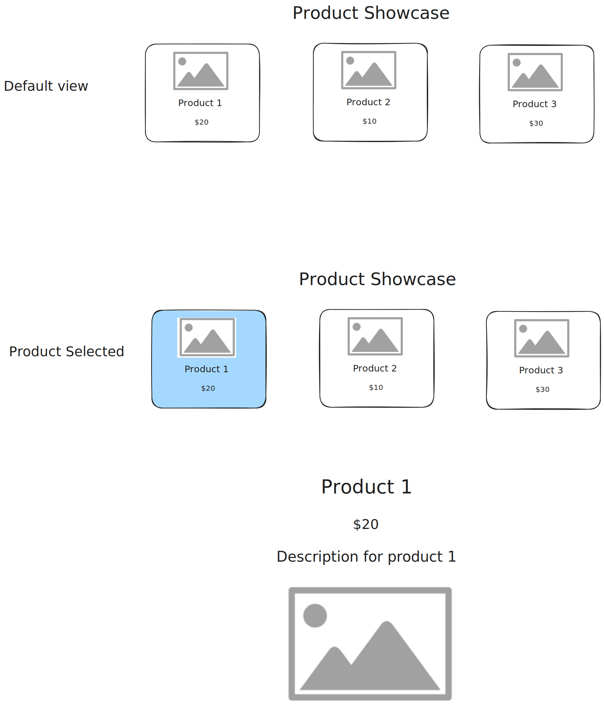

# Project: Build a Lights Out game with React

In this project, you'll create the "Lights Out" game using React.

For every step:
- Read the brief and acceptance criteria. If unsure, seek help immediately.
- When you’ve fulfilled the acceptance criteria, make a commit and push it to GitHub.

Here's a sketch of what you'll build:



---

## Step 1: Fork the starter repository

**Brief:**  
Fork this repository to your account to begin the project. Check that the project can run (`npm install`, `npm run start`).

**Acceptance Criteria:**
- ✅ The repository is forked to your GitHub account.
- ✅ You have cloned the forked repository to your local machine.
- ✅ You have ran the project and it displays an empty page.

---

## Step 2: Create the Header component

**Brief:**  
Build a `Header` component that displays the app's title.

**Acceptance Criteria:**
- ✅ Your repository contains `Header.js` file in the appropriate folder.
- ✅ `Header.js` contains a functional component that renders an `<h1>` with the title "Lights Out".
- ✅ The header component is at the top of the page.

---

## Step 3: Create the Cell component

**Brief:**  
Build a `Cell` component representing a single light. The component should be a clickable button. Add css to make the button look like a light.

Below is a sample style to get you started:
```
width: 25px;
height: 25px;
border-radius: 50%;
border: none;
margin: 20px;
background-color: rgb(28, 195, 72);
```

**Acceptance Criteria:**
- ✅ Your repository contains `Cell.js` and `Cell.css` files in the appropriate folder.
- ✅ `Cell` accepts `cellIndex`, `isOn`, and `toggleLight` as props.
- ✅ `Cell.css` contains a style representing an "on" light and an "off" light.
- ✅ `Cell` renders a button with the appropriate style depending on the prop `isOn`.

---

## Step 4: Create the Board component

**Brief:**  
Build a `Board` component which represents the 5x5 grid where the `Cell`s will be placed. 

**Acceptance Criteria:**
- ✅ `Board` contains a functional component that imports `Cell`.
- ✅ `Board` contains a 5x5 2d array of `bool` which represents the state of each light.
- ✅ `Board` renders a 5x5 grid of cells.

---

## Step 5: Create a static board of lights for testing 

**Brief:**  
Add static product data to `ProductList` to simulate a product catalog.

**Acceptance Criteria:**
- ✅ The static product data includes properties: `id`, `name`, `price`, `description`, and `imageURL`.
- ✅ This data is passed as props to `ProductCard` components within `ProductList`.
- ✅ Each product renders as a `ProductCard` on the page.

---

## Step 6: Create the ProductCard Component

**Brief:**  
Design the `ProductCard` component to display individual product information.

**Acceptance Criteria:**
- ✅ `ProductCard` accepts props for `name`, `price`, and `image`.
- ✅ The product name, price, and image are displayed within a styled card layout.
- ✅ Each `ProductCard` is clickable to select the product for viewing in `ProductDetail`.

---

## Step 7: Create the ProductDetail Component

**Brief:**  
Build a `ProductDetail` component that displays detailed information for a selected product.

**Acceptance Criteria:**
- ✅ `ProductDetail` accepts `name`, `price`, `description`, and `image` as props and displays them.
- ✅ The product details are shown in a styled layout that distinguishes it from the `ProductList`.

---

## Step 8: Implement Product Selection

**Brief:**  
Add functionality to select a product and display its details.

**Acceptance Criteria:**
- ✅ Clicking on a `ProductCard` sets that product as the selected product.
- ✅ The selected product is passed to `ProductDetail` for display.
- ✅ Only one product’s details are shown at a time.

---

## Step 9: Conditional Rendering of ProductDetail

**Brief:**  
Ensure that `ProductDetail` only appears when a product is selected.

**Acceptance Criteria:**
- ✅ `ProductDetail` is hidden when no product is selected.
- ✅ Clicking a product in `ProductList` updates the displayed details in `ProductDetail`.
- ✅ If a new product is selected, the displayed details update accordingly.

---

## Step 10: Basic Styling

**Brief:**  
Add styles to enhance the layout and make the app visually appealing.

**Acceptance Criteria:**
- ✅ The `Header` is styled and centered.
- ✅ `ProductCard` components have a border, padding, and are arranged in a grid or flex layout.
- ✅ `ProductDetail` has distinct styling to differentiate it from `ProductList`.

---

## Step 11: Final Review and Refactor

**Brief:**  
Review the app to ensure it meets all acceptance criteria, refactor code for readability, and add comments where needed.

**Acceptance Criteria:**
- ✅ The code is clean, with properly named variables and functions.
- ✅ Unnecessary console logs are removed.
- ✅ All components function as expected without errors.

--- 
